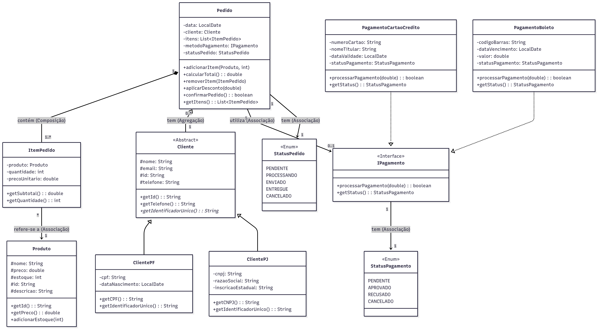

# Sistema eComerce em Java
Projeto de um sistema simples para praticar **POO** em Java.



## Descrição da atividade

Aqui está o que cada método chave deve fazer:

---

### **ItemPedido**

- **`getSubtotal()`**:  
  Deve retornar `this.precoUnitario * this.quantidade`.

---

### **IPagamento**

- **`processarPagamento(double valor)`**:
  - **Em `PagamentoCartaoCredito`**: simule uma lógica de autorização.  
    Por exemplo, se o valor for menor que **5000**, mude o `statusPagamento` para **APROVADO** e retorne **true**.  
    Caso contrário, mude para **RECUSADO** e retorne **false**.
  - **Em `PagamentoBoleto`**: simule o registro.  
    Como um boleto não é pago imediatamente, apenas mude o `statusPagamento` para **APROVADO** (significando que foi gerado com sucesso) e retorne **true**.

- **`getStatus()`**:  
  Retorna o valor do atributo `statusPagamento`.

---

### **Pedido**

- **`adicionarItem(Produto produto, int quantidade)`**:
  - Verifica se um item com o mesmo produto já existe na lista `itens`.  
  - Se existir, apenas **soma a nova quantidade** à quantidade do item existente.  
  - Se não existir, cria um `new ItemPedido(produto, quantidade)` e o adiciona à lista `itens`.

- **`removerItem(ItemPedido item)`**:  
  Remove o objeto `item` da lista `itens`.

- **`calcularTotal()`**:  
  Itera sobre a lista `itens` e retorna a soma de todos os `item.getSubtotal()`.

- **`aplicarDesconto(double desconto)`**:  
  Aplica o desconto no produto usando o atributo `desconto` para reduzir do valor total.

- **`confirmarPedido()`**:  
  Orquestra o fluxo de confirmação:
  1. Verifica se o `statusPedido` atual é **PENDENTE**. Se não for, retorna **false**.  
  2. Verifica se o `metodoPagamento` foi definido (não é nulo). Se for nulo, retorna **false**.  
  3. Chama o método:
     ```java
     metodoPagamento.processarPagamento(this.calcularTotal());
     ```
  4. Com base no retorno (**true** ou **false**) do passo anterior:  
     - Se **true**, muda o `statusPedido` para **PROCESSANDO**.  
     - Se **false**, mantém o `statusPedido` como **PENDENTE**.  
  5. Retorna o mesmo boolean que recebeu do método de pagamento.
